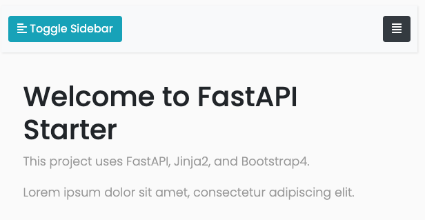

# PJI240 - Frontend

Based on:

[https://shinichiokada.medium.com/](https://shinichiokada.medium.com/) ([Building a Website Starter with FastAPI](https://levelup.gitconnected.com/building-a-website-starter-with-fastapi-92d077092864)).

## Overview

A static simple website ready to deploy to Heroku.

- .env
- .gitignore
- app
- Procfile
- README.md
- requirements.txt
- runtime.txt
- static
- templates

## Requirement

See requirements.txt for updates.

```sh
requests==2.27.1
fastapi==0.72.0
uvicorn==0.17.0
python-dotenv==0.19.2
aiofiles==0.8.0
python-multipart==0.0.5
jinja2==3.0.3
Markdown==3.3.6
pytest==6.2.5
```

## Installation & Usage

- with docker:
```sh
# change TARGET with prod or debug
docker-compose build --no-cache website_<TARGET>
docker-compose up website_debug
```
- no docker:
```bash
$ git clone git@github.com:shinokada/fastapi-web-starter.git
$ cd fastapi-web-starter
# install packages
$ pip install -r requirements.txt
# start the server
$ uvicorn app.main:app --reload --port 8080
```

Visit [http://0.0.0.0:5001/](http://0.0.0.0:5001/).



## Features

- Menu
- Unsplash
- Accordion
- Markdown pages

## Test

All tests are under `tests` directory.

```bash
# Change the directory
$ cd fastapi-web-starter
# Run tests
$ pytest -v
```
